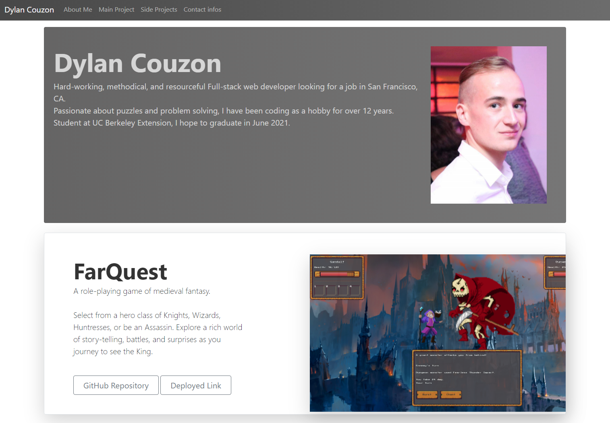

# Portfolio-3
Portfolio #3 for UC Berkeley coding Bootcamp

[](https://opensource.org/licenses/MIT)



## Technologies Used
- HTML
- CSS
- JavaScript
- [Bootstrap](https://getbootstrap.com/)
- [jQuery](https://jquery.com/)
- [Node.js](https://nodejs.org/en/)
- [npm](https://www.npmjs.com/) packages
    - [express](https://www.npmjs.com/package/express)
    - [mongoose](https://mongoosejs.com/)
- [HEROKU](https://www.heroku.com/)

## Summary 
This is my third Portfolio realized for UC Berkeley Coding Bootcamp
The App gives you access to a brief description of myself, my most recent project, some secondary projects, and my contact infos.
All the data is stored in a NoSQL database using Mongoose to allow me to update the portfolio without having to change the code

## How to install
```
node install
```

Update your Mysql infos in .ENV.EXAMPLE, rename the file .ENV, then execute db.sql in Mysql.
(The secret must be a random string that will be used to encode the user Sessions).

## How to use it
run the commande 

```
npm start then browse http://localhost:3000
```

## Code Snippet  
```Javascript 
{
    name: "FarQuest",
    description: "A role-playing game of medieval fantasy.<br><br>Select from a hero class of Knights, Wizards, Huntresses, or be an Assassin. Explore a rich world of story-telling, battles, and surprises as you journey to see the King.<br><br>",
    image: "FarQuest.png",
    githubLink: "https://github.com/Dylancouzon/farQuest",
    deployedLink: "https://farquest.herokuapp.com",
    main: 1
},
```
This code Snippet represents one of my projects that populates the noSQL database. Main define the main project that will be shown on the webpage.

## Deployed Link

[See Live Site](https://dc-portfolio3.herokuapp.com/)


## Author Links
[LinkedIn](https://www.linkedin.com/in/dcouzon/)
[GitHub](https://github.com/Dylancouzon)
